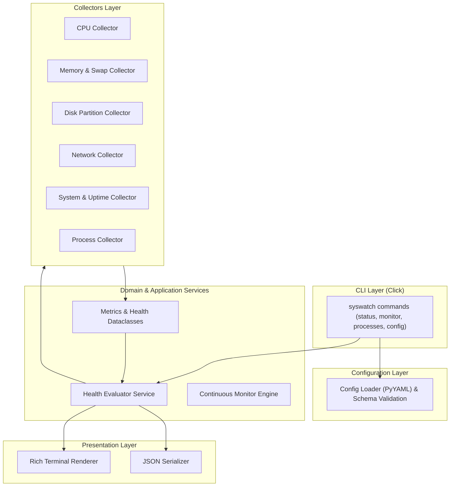

# syswatch Architecture Documentation

This document explains the design principles, architectural boundaries, and data flow of `syswatch`.

---

## Architectural Blueprint

---

## Core Layers & Responsibilities

<b>1. CLI Layer (<code>cli.py</code>)</b>

- Routes command line flags using `Click`.
- Handles global context (`--config PATH`).
- Maps business status (`OK`, `WARNING`, `CRITICAL`) to standard CLI exit codes ($0, 1, 2$).
- Catches top-level user interrupts (`KeyboardInterrupt`) cleanly.

<b>2. Application & Business Logic Services (<code>services/</code>)</b>

- **`HealthEvaluatorService`**: Compares raw metric values against warning and critical thresholds. Escalates system health to the worst-case status among components (`CRITICAL` > `WARNING` > `UNKNOWN` > `OK`).
- **`ContinuousMonitorService`**: Controls live sampling loops, calculates network transfer rates ($\text{MB/s}$) across time deltas ($\Delta t$), and updates Rich `Live` displays.

<b>3. Metric Collectors (<code>collectors/</code>)</b>

- Interfaces with `psutil`, `platform`, and Linux `/proc` kernel interfaces.
- Returns pure dataclass domain models.
- Implements path error isolation in disk collection and catches `NoSuchProcess` / `AccessDenied` exceptions during process scanning.

<b>4. Presentation Layer (<code>output/</code>)</b>

- **`rich_output.py`**: Formats binary units (`GiB`, `MiB`), uptime, panels, tables, and status badges.
- **`json_output.py`**: Serializes domain snapshots into machine-readable JSON strings with ISO-8601 UTC timestamps.

